# Hot Utils - Creating and switching to a new Mod Loadout for Special Mission (e.g. TB Reva Mission)

Some missions require a very specific set of mods with certain stats, speed and turn order. This guide will explain how to use Hot Utils to save your current mods, great a new loadout, switch to it and restore the default.

- [Hot Utils - Creating and switching to a new Mod Loadout for Special Mission (e.g. TB Reva Mission)](#hot-utils---creating-and-switching-to-a-new-mod-loadout-for-special-mission-eg-tb-reva-mission)
  - [Hot Utils](#hot-utils)
  - [Saving your current mods](#saving-your-current-mods)
  - [Updating your Default Loadout](#updating-your-default-loadout)
  - [Creating a new Loadout for a Special Mission (here: TB Reva Mission)](#creating-a-new-loadout-for-a-special-mission-here-tb-reva-mission)
  - [Running the special mission](#running-the-special-mission)

## Hot Utils

[Hot Utils](https://hotutils.com/) is a paid service that provides a wide range of utilities to manage your SWGOH account. There are four tiers

| 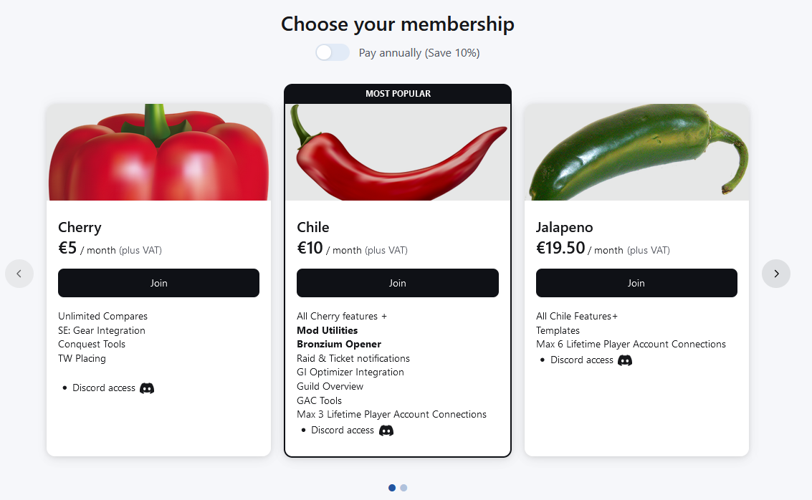 |
| :--: |
| *Hot Utils Prices* |

To get access to the mod utilities you need subscribe to second (or higher) tier. The fourth tier is 39€/month and is mostly just for guild leaders and officers or people you want to gift memberships to other users (includes 3 free Chile gifts).

## Saving your current mods

1. Login to [Hot Utils](https://hotutils.com/)
2. Go to the Mod Loadout page
   
| 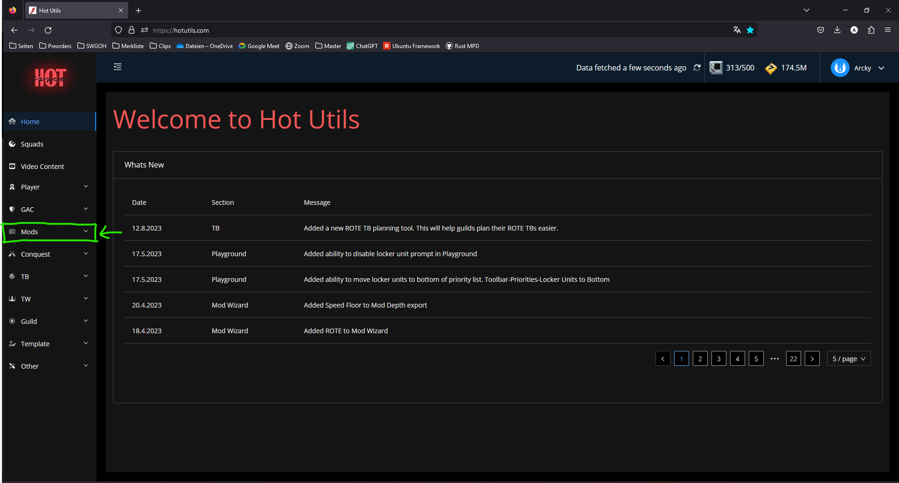 |
| :--: |
| 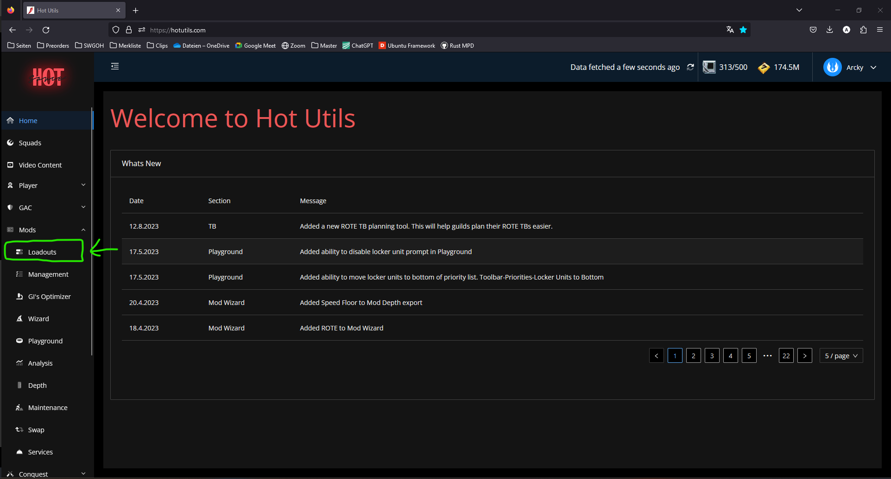 |

3. Create a new loadout

| 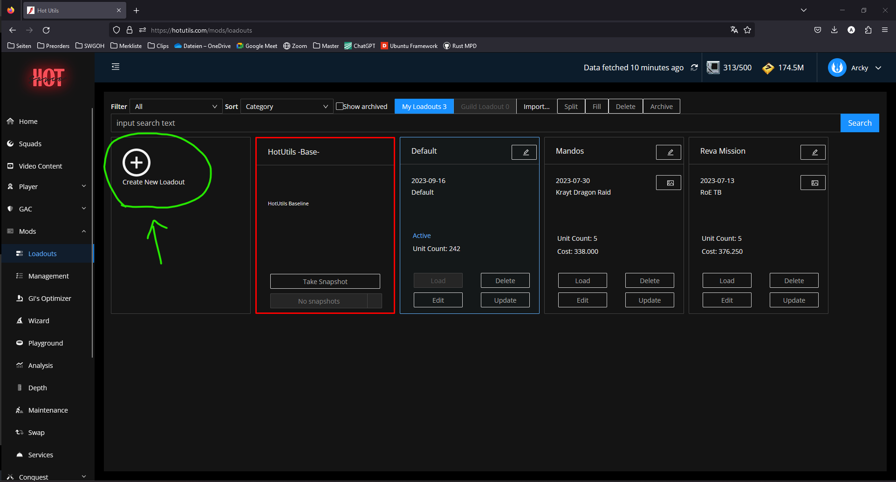 |
| :--: |
| 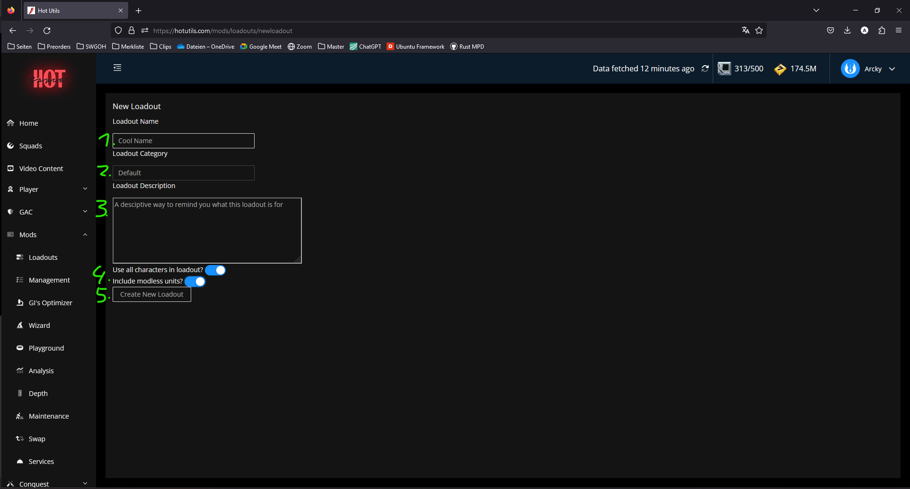 |
| *1.) Give your Loadout a Name* |
| *2.) Assign it to a Category* |
| *3.) Give it a Description* |
| *4.) Toggle on both options* |
| *5.) Create it* |

4. Congratz on your backup.

| 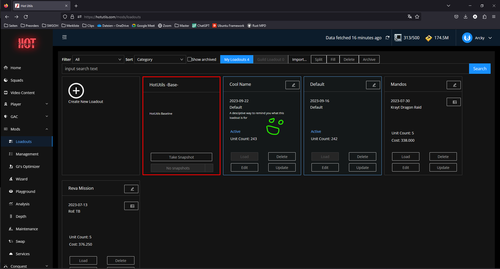 |
| :--: |
| *Take note of the cyan border and `Active` signaling you that this loadout is currently equipped in game* |

## Updating your Default Loadout

If you come to the loadout page and your Default Loadout is not `Active` you should update your Default Loadout.

Note: your Default Loadout may not be `Active` because you have moved mods around in game or added a new character to your roster.

| 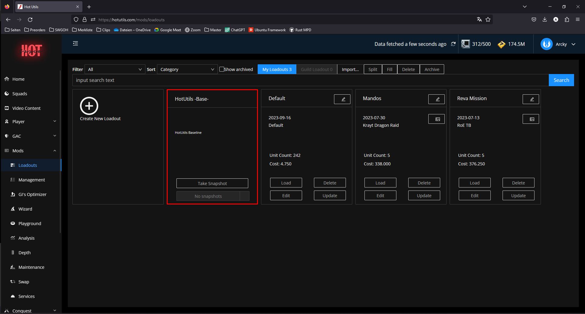 |
| :--: |
| *Default no longer `Active`* |

1. Click on `Update` on your Default Loadout
   
| 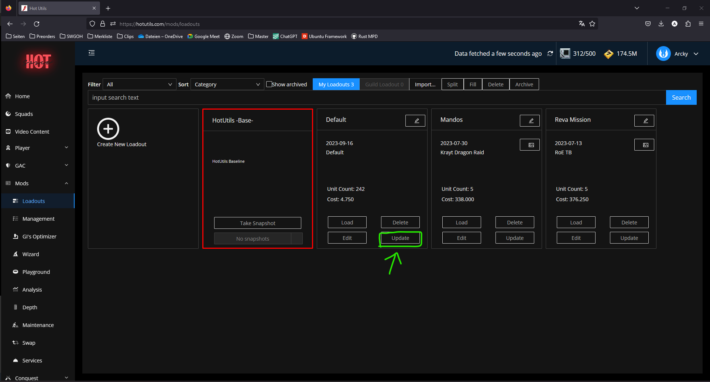 |
| :--: |

2. Toggle shown options and click update.

| 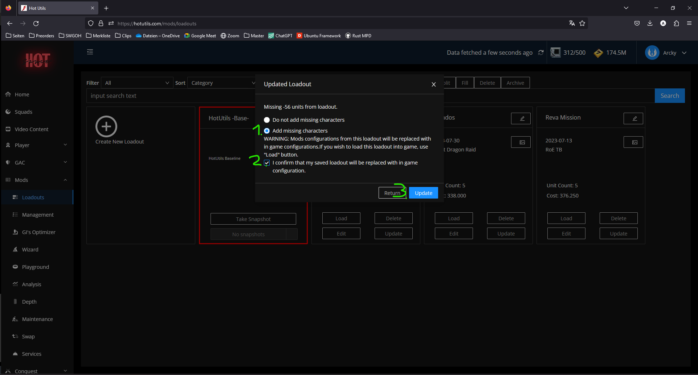 |
| :--: |
| *Add missing characters (1.), confirm (2.) and update (3.)* |

3. Loadout has been updated.

| 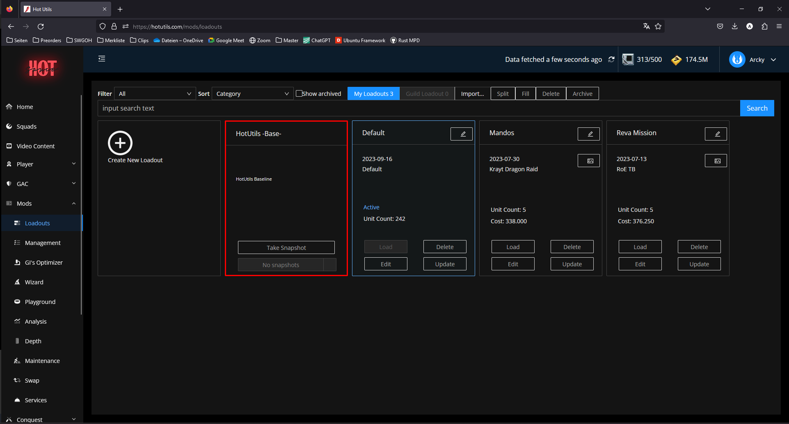 |
| :--: |
| *Default Loadout is back to being `Active`* |

## Creating a new Loadout for a Special Mission (here: TB Reva Mission)

1. Make sure you have a Default Loadout and it is currently `Active` (saved)
2. Apply the new mods to your characters either
   - In game
   - Using Hot Utils Mod Management (haven't used that myself)
3. Come back to the Mod Loadout page and create a new Loadout
4. Follow steps as shown

| 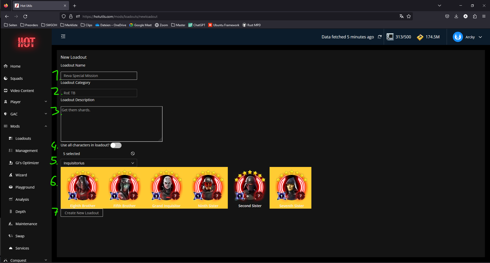 |
| :--: |
| *1.) Give the loadout a name`* |
| *2.) Assign the loadout to a category`* |
| *3.) Describe the loadout`* |
| *4.) Don't use all characters`* |
| *5.) Choose a fraction`* |
| *6.) Select the units you want to save`* |
| *7.) Create new loadout`* |

5. You have created a new specialized loadout
   
| 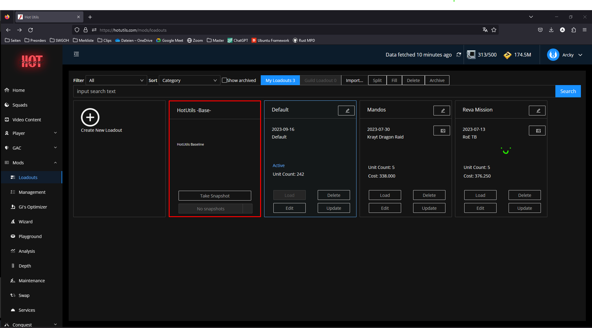 |
| :--: |

## Running the special mission

1. Update your Default Loadout, [see](#updating-your-default-loadout) (optional, if not `Active`)
2. Load your special loadout

| 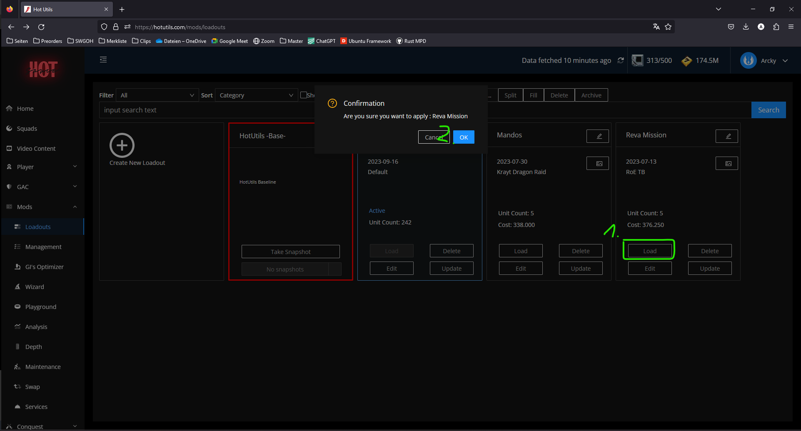 |
| :--: |
| *1.) Load your desired loadout`* |
| *2.) Confirm`* |

3. Go in game and get a shard for the guild ;-)
4. Log back in to Hot Utils and do step 2. again with your Default Loadout